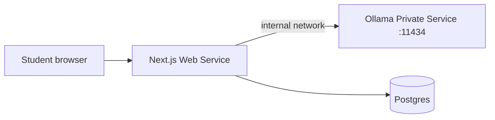

# Ollama AI Tutor — local development & Render production

The **AI Study Tutor** (`Study smarter with guided help`) calls your app’s API, which talks to [Ollama](https://ollama.com) on the server. Students never call Ollama directly.

| Environment | Ollama runs on | App env var |
|-------------|----------------|-------------|
| **Local** | Your machine (`127.0.0.1:11434`) | `OLLAMA_BASE_URL=http://127.0.0.1:11434` |
| **Render** | Private Docker service (internal URL) | `OLLAMA_BASE_URL=http://school-sms-ollama:11434` |

---

## 1. Local setup

### Install Ollama

- Download: https://ollama.com/download  
- Or Linux: `curl -fsSL https://ollama.com/install.sh | sh`

### Pull a model

Default for this project:

```bash
ollama pull llama3.1:8b
```

You already have this model if `ollama list` shows `llama3.1:8b`.

Or use the project script:

```bash
chmod +x scripts/ollama-setup-local.sh
./scripts/ollama-setup-local.sh
```

### App environment (`.env`)

```env
OLLAMA_BASE_URL=http://127.0.0.1:11434
OLLAMA_MODEL=llama3.1:8b
AI_TUTOR_ENABLED=true
AI_TUTOR_FALLBACK_MOCK=true
OLLAMA_TIMEOUT_MS=120000
```

- **`AI_TUTOR_FALLBACK_MOCK=true`** — if Ollama is down, students still get guided (rule-based) replies instead of an error.
- Set to `false` in production if you want hard failures when Ollama is unavailable.

### Run the app

```bash
npm run dev
```

Open **Student → AI Tutor**. The header shows **Ollama connected** when `/api/student/ai-tutor/status` can reach the model.

---

## 2. Render production architecture



1. **Web service** — existing `school-management-system` (Node).
2. **Private service** — Ollama Docker image (`docker/ollama/Dockerfile`), not exposed to the public internet.
3. Web service env: `OLLAMA_BASE_URL=http://<private-service-hostname>:11434`.

Render private services are reachable only from other Render services in the same account/region.

---

## 3. Deploy Ollama on Render

### A. Create the private service

1. Render Dashboard → **New** → **Private Service**.
2. Connect this repo.
3. **Root directory**: leave default (repo root).
4. **Environment**: Docker.
5. **Dockerfile path**: `docker/ollama/Dockerfile`.
6. **Name**: e.g. `school-sms-ollama` (note the hostname for env vars).
7. **Plan**: `llama3.1:8b` needs substantial RAM — use **Standard** (2GB+) or larger on Render (free/starter 512MB is not enough).
8. **Port**: `11434` (must match `OLLAMA_HOST` in the Dockerfile).

### B. Pull the model on Render (one-time)

Use Render **Shell** on the Ollama service (or a one-off job):

```bash
ollama pull llama3.1:8b
```

Verify:

```bash
curl -s http://127.0.0.1:11434/api/tags
```

### C. Configure the web service

In **school-management-system** → **Environment**:

| Variable | Example |
|----------|---------|
| `OLLAMA_BASE_URL` | `http://school-sms-ollama:11434` (use your private service’s internal host; Render shows this under service networking) |
| `OLLAMA_MODEL` | `llama3.1:8b` |
| `AI_TUTOR_ENABLED` | `true` |
| `AI_TUTOR_FALLBACK_MOCK` | `false` (optional: `true` during rollout) |
| `OLLAMA_TIMEOUT_MS` | `120000` |

Redeploy the web service after saving env vars.

### D. Blueprint (`render.yaml`)

The repo includes an optional `school-sms-ollama` private service block. After linking the blueprint:

1. Set `DATABASE_URL`, `AUTH_SECRET`, `NEXTAUTH_URL` as before.
2. Set `OLLAMA_BASE_URL` on the web service to the internal Ollama URL from the dashboard.
3. Upgrade Ollama service plan if pulls or inference OOM.

---

## 4. Knowledge source modes (RAG vs general)

Students choose **Knowledge source** in the AI Tutor UI:

| Mode | Behavior |
|------|----------|
| **Textbook (RAG)** | Retrieves relevant chapter (and future uploaded) passages, cites pages, textbook-only answers |
| **General (no RAG)** | Socratic tutor using grade/subject knowledge; no invented textbook pages |

API field: `knowledgeMode`: `"rag"` \| `"general"`.

Implementation: `src/lib/ai/rag-retrieval.ts` (keyword ranking today; embeddings later).

---

## 5. API endpoints (for future AI features)

| Route | Method | Purpose |
|-------|--------|---------|
| `/api/student/ai-tutor/status` | GET | Health + installed models (student session required) |
| `/api/student/ai-tutor/chat` | POST | Socratic chat with `knowledgeMode` (student session required) |

Reuse `src/lib/ai/ollama.ts` and `src/lib/ai/tutor-prompt.ts` for quiz generation, writing feedback, etc.

---

## 6. Speed tuning (target ~5–12s)

Default tutor settings (in `.env`):

| Variable | Default | Purpose |
|----------|---------|---------|
| `OLLAMA_TIMEOUT_MS` | `12000` | Fail fast instead of waiting 2 minutes |
| `OLLAMA_NUM_PREDICT` | `140` | Short answers = faster generation |
| `OLLAMA_NUM_CTX` | `3072` | Smaller context window |
| `OLLAMA_MAX_HISTORY` | `4` | Fewer prior turns in the prompt |
| `OLLAMA_KEEP_ALIVE` | `15m` | Keeps model loaded between questions |

The API **streams** tokens to the browser so text appears within 1–2s on a warm model. Opening **AI Tutor** warms the model via `/api/student/ai-tutor/status`.

If replies still feel slow on CPU, run once: `ollama run llama3.1:8b` before using the app.

---

## 7. Troubleshooting

| Symptom | Fix |
|---------|-----|
| “Ollama offline — guided fallback” locally | Run `ollama serve`, confirm `ollama list` includes `llama3.1:8b` |
| Status shows model not installed | `ollama pull` the name in `OLLAMA_MODEL` |
| Render timeout / 503 | Increase `OLLAMA_TIMEOUT_MS`; use a smaller model; scale Ollama plan RAM |
| Web can’t reach Ollama on Render | Confirm private service name in `OLLAMA_BASE_URL`; both services same region |
| Out of memory on Render | Upgrade Ollama instance RAM, or use a smaller model and set `OLLAMA_MODEL` accordingly |

---

## 8. Security notes

- Ollama has **no built-in auth**. On Render, keep it as a **private service** only.
- Never set `OLLAMA_BASE_URL` to a public URL without a reverse proxy + auth.
- Chat requests are authenticated as **STUDENT** via NextAuth.
